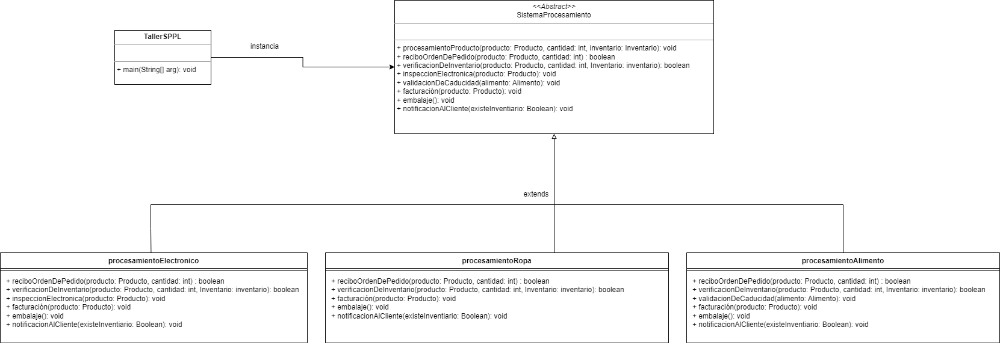
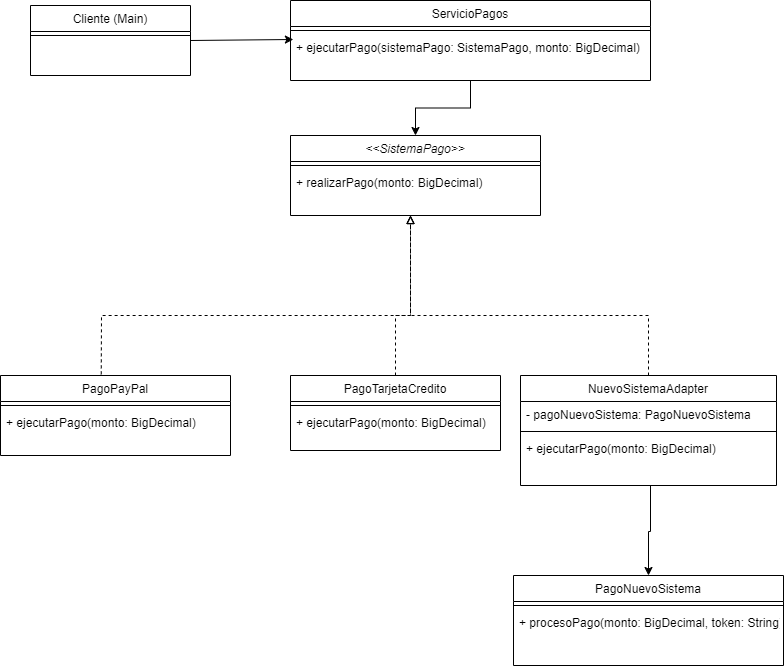

# EJERCICIOS PATRONES DE DISEÑO DIPLOMADO EN ARQUITECTURA DE SOFTWARE 
# GRUPO 1

## Contenido
[Ejercicio1](#ejercicio1)

[Ejercicio2](#ejercicio2)

[Ejercicio3](#ejercicio3)

[Tecnologias](#tecnologias)

[Instalacion](#instalacion)

[Integrantes](#integrantes)

### <a name="ejercicio1"></a>
## Ejercicio1

Teniendo en cuenta el ejercicio 1:
SPPL (Sistema de Procesamiento de Pedidos en Línea)
L@ llamaron para desarrollar un sistema de comercio electrónico para una tienda en línea que vende una variedad de productos, como electrónicos, ropa y productos alimenticios.
Cada tipo de producto tiene un proceso de procesamiento de pedidos ligeramente diferente debido a los requisitos únicos de cada categoría. Sin embargo, hay algunos pasos generales que se aplican a todos los tipos de productos, como la verificación de inventario, la facturación y la notificación al cliente.
El problema radica en la necesidad de implementar este sistema de procesamiento de pedidos con múltiples pasos, pero permitiendo variaciones específicas para cada tipo de producto. Además, también debes considerar la posibilidad de futuras expansiones en la variedad de productos y pasos adicionales en el proceso de procesamiento.
El patrón de diseño que escoja debe permitir manejar la complejidad de la variación en el proceso de procesamiento de pedidos, al tiempo que garantiza que los pasos generales sean consistentes para todos los tipos de productos. Recuerde que busca facilitar la extensión del sistema a medida que la tienda en línea crece y se diversifica.

A continuación encontrará un modulo construido en Java , el cual es un Sistema de Procesamiento de Pedidos en Línea, en donde la compañía vende una viariedad de productos (electronivos, ropa y productos alimenticios), cada tipo de producto tiene un procesamiento de pedidos de a cuerdo a sus características existiendo pasos generales que se aplican a todos los tipos de productos y otros que no.
Dicho sistema permite visualizar mensajes durante el proceso de procesamiento del pedido segun validaciones en el stock de la cantidad solicitada del producto y demás validaciones según el tipo de producto.

En el modulo mencionado, se usó el patrón de comportamiento Template Method.

Template Method es un patrón de diseño de comportamiento que define el esqueleto de un algoritmo en la superclase pero permite que las subclases sobrescriban pasos del algoritmo sin cambiar su estructura
https://refactoring.guru/es/design-patterns/template-method

### Diagrama de clases

  


### <a name="ejercicio2"></a>
## Ejercicio2

Teniendo en cuenta el ejercicio 2:
Imagina que estás desarrollando una plataforma de comercio electrónico y deseas ofrecer a tus clientes múltiples opciones de pago, incluyendo tarjetas de crédito, PayPal y un nuevo sistema de pago digital que acaba de ser lanzado. Sin embargo, este nuevo sistema de pago tiene una interfaz incompatible con tu plataforma existente, lo que dificulta su integración.

Tu solución debe permitir lograr una integración suave y coherente del nuevo sistema de pago en tu plataforma de comercio electrónico, sin tener que modificar la lógica interna de tu sistema existente. Para facilitar la adopción de nuevas tecnologías y sistemas en tu aplicación sin interrumpir su funcionalidad principal.

A continuación encontrará un modulo construido en Java , el cual es una Plataforma de comercio electrónico, /*/que hace la app*///*/*/

En el modulo mencionado, se usó el patrón de estructural Adapter para solucionar el problema planteado y adicionalmente se utiliza el patrón de comportamiento Strategy para permitir la adopción de futuros metodos de pago que podrian o no llegar a requerir un adapter en sus diferentes implementaciones.

Adapter es un patrón de diseño estructural que permite la colaboración entre objetos con interfaces incompatibles.
https://refactoring.guru/es/design-patterns/adapter

Strategy es un patrón de diseño de comportamiento que te permite definir una familia de algoritmos, colocar cada uno de ellos en una clase separada y hacer sus objetos intercambiables.
https://refactoring.guru/es/design-patterns/strategy


### Diagrama de clases

  

### <a name="ejercicio3"></a>
## Ejercicio3

Imagina que estás trabajando en una aplicación de pedidos de pizza en línea y necesitas implementar un sistema de construcción de órdenes personalizadas. Los clientes deben poder crear pizzas personalizadas con ingredientes específicos, tamaños de porción y opciones de cobertura.
Requerimientos del sistema:
1. Los clientes deben poder crear una pizza personalizada eligiendo entre diferentes tamaños de porción (pequeño, mediano, grande) y opciones de masa (delgada, gruesa, integral).
2. Los ingredientes disponibles para la pizza incluyen queso, pepperoni, jamón, champiñones, pimientos, cebolla, aceitunas y piña.
3. Los clientes pueden seleccionar múltiples ingredientes para agregar a su pizza. Pueden elegir la cantidad de cada ingrediente.
4. Las pizzas pueden tener una cobertura adicional en forma de queso extra en el borde de la masa.
5. Los clientes deben poder calcular el costo total de su pizza en función de las selecciones realizadas, incluyendo el tamaño de la porción, los ingredientes y la cobertura adicional.
6. Una vez que los clientes hayan construido su pizza personalizada, deben poder revisarla y realizar el pedido.

A continuación encontrará un modulo construido en Java , el cual es una Aplicación de pedidos de pizza en línea, /*/que hace la app*///*/*/

En el modulo mencionado, se usó el patrón Creacional Builder en conjunto con el patrón Factory Method.

https://refactoring.guru/es/design-patterns/builder

### Diagrama de clases

  


### <a name="tecnologias"></a>
## Tecnologias

* Java 21 (JDK 21)
  * [JDK Development Kit 21](https://www.oracle.com/co/java/technologies/downloads/#jdk21-windows)

### <a name="instalacion"></a>
## Instalacion

Para la istalación del proyecto:
-Clone el proyecto ejecutando el siguiente comando:
```bash
git clone git@github.com:angiekroll/patrones-diseno.git
```
- Abra el proyecto con el IDE de su preferencia
- Ejecute la clase principal "Main" del paquete de cada modulo

Ejercio 1 --> src\main\java\com\ejerciciouno\Main.java

Ejercio 2 --> src\main\java\com\ejerciciodos\Main.java

Ejercio 3 --> src\main\java\com\ejerciciotres\Main.java

La ULR del proyecto es
- https://github.com/angiekroll/patrones-diseno

### <a name="integrantes"></a>
## Integrantes
- Angela Castillo Rodríguez
- Daniel Sebastian Leal Rodríguez
- Eliana Katherine Guerrero Guerrero
- Edward Augusto Ramirez Rodriguez
- Guillermo Danel Pulecio Gonzalez
- Juan Andres Perez Trejos
